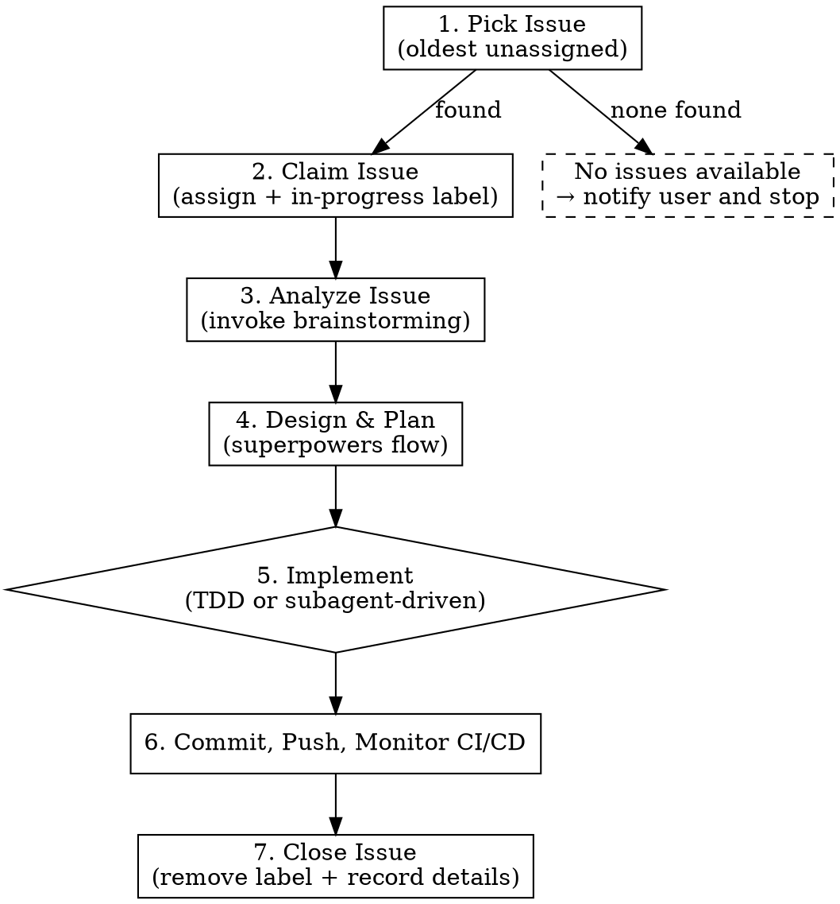

# GitHub Issue Workflow

## Overview

End-to-end workflow: pick an unassigned issue, analyze it, design a solution, implement, deploy, and close with full traceability.

**Core principle:** Every step leaves a trace on the issue. No silent work.

## When to Use

- User says "pick up an issue", "work on next issue", "grab an issue"
- User wants to process GitHub issues systematically
- Starting a new development cycle from the issue backlog

## Workflow



## Step Details

### 1. Pick Issue

```bash
gh issue list --state open --no-assignee --json number,title,labels,createdAt --jq 'sort_by(.createdAt) | .[0]'
```

- Select the **oldest** unassigned open issue
- If no issues found, notify user and **stop**

### 2. Claim Issue

```bash
gh issue edit <number> --add-assignee @me --add-label in-progress
```

Both actions in one command. Issue is now visibly claimed.

### 3. Analyze Issue (invoke brainstorming)

Invoke `/brainstorming` skill with the issue content. During analysis:

**Image handling:** If issue body contains image URLs (`github.com/user-attachments/assets/...`), download and read them with the Read tool to understand visual context (error screenshots, UI issues).

**Bug vs Enhancement:** Check issue labels:
- `bug` label → use `/systematic-debugging` to trace root cause before brainstorming solutions
- `enhancement` / `feature` / no label → brainstorming focuses on design and approach

**Record everything:** Post analysis findings and clarification questions as comments on the issue:

```bash
gh issue comment <number> --body "## Analysis

**Issue type:** bug / enhancement
**Root cause / Scope:** ...
**Proposed approach:** ...
**Questions:** ..."
```

Wait for user confirmation before proceeding.

### 4. Design & Plan

Follow the superpowers flow:
1. `/brainstorming` produces a design → get user approval
2. `/writing-plans` creates implementation plan → get user approval
3. Save design doc to `docs/plans/YYYY-MM-DD-<topic>-design.md`

### 5. Implement

Choose strategy based on plan complexity:

| Condition | Strategy |
|-----------|----------|
| Single focused change, few files | `/test-driven-development` |
| Multiple independent tasks, many files | `/subagent-driven-development` |

Launch a subagent to execute the plan. The subagent must:
- Follow the chosen strategy strictly
- Ensure all tests pass before reporting completion

### 6. Deploy

```bash
# Commit (message must reference issue)
git add <specific-files>
git commit -m "fix/feat(...): description

Closes #<number>

Co-Authored-By: Claude Opus 4.6 (1M context) <noreply@anthropic.com>"

# Push directly to main
git push origin main

# Monitor CI/CD until completion
gh run list --limit 1
gh run watch <run-id>
```

**IMPORTANT:**
- Push to `main` directly (no branch/PR — this is the project convention)
- Monitor CI/CD with `gh run watch` until deployment succeeds
- If CI fails, diagnose, fix, and re-push

### 7. Close Issue

```bash
# Get full commit hash
COMMIT=$(git rev-parse HEAD)
REPO_URL=$(gh repo view --json url --jq .url)

# Remove in-progress label
gh issue edit <number> --remove-label in-progress

# Add closing comment with commit link
gh issue comment <number> --body "## Changes

**Summary:** ...

**Commit:** [<short-hash>](${REPO_URL}/commit/${COMMIT})"

# Close (if not auto-closed by commit message)
gh issue close <number>
```

**CRITICAL:** The closing comment MUST include a clickable commit link, not just a hash.

## Common Mistakes

| Mistake | Correct |
|---------|---------|
| Picking issues by priority guess | Always pick **oldest** unassigned |
| Forgetting `in-progress` label | Add label immediately when claiming |
| Skipping image analysis in issues | Download and read every image |
| Not recording analysis on issue | Post analysis as issue comment |
| Plain commit hash in closing comment | Always use `[hash](url)` markdown link |
| Creating branch/PR | Push to main directly (project convention) |
| Not monitoring CI/CD | Use `gh run watch` until deploy completes |
| Forgetting to remove `in-progress` label | Remove before closing |
