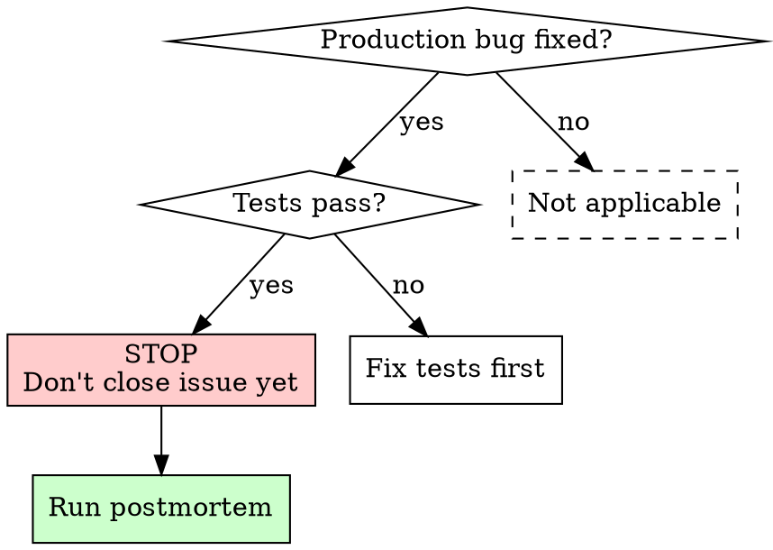

# Production Bug Postmortem

## Overview

When you fix a production bug, you're not done when tests pass. You must analyze why tests didn't catch it.

**Core principle:** Tests passed before the bug too. "Tests pass" proves nothing about test quality.

**Violating the letter of this process is violating the spirit of the process.**

## When to Use



## The Iron Law

```
NO CLOSING ISSUE WITHOUT POSTMORTEM
```

Bug fixed + tests pass ≠ done. You must answer: **"Why didn't tests catch this before?"**

## Process

### 1. Collect Evidence

Extract **real** production data (logs, API responses, error messages):

```bash
# Get actual API response format from production logs
grep "API response" production.log | tail -5

# Get exact error messages
grep "ERROR\|FAIL" production.log | tail -20
```

**You need:** The real data that triggered the bug, not what you imagined it looked like.

### 2. Compare Mock vs Reality

For each test that should have caught the bug:

| | Test Mock | Production Reality |
|---|----------|-------------------|
| Data format | `{ msgId: 'fake_123' }` | `{ msgId: 0, newMsgId: '172...' }` |
| Edge values | Always valid strings | Zero, null, empty |
| Operation count | Single operation | Consecutive operations |

**Ask:** "Would this test have caught the bug with real production data?"

If no → that's a test gap.

### 3. Write Missing Tests

**Use real data format** (from step 1, not invented):
```typescript
// ❌ Mock matches imagination
mockResolvedValue({ id: 'test_123' })

// ✅ Mock matches production logs
mockResolvedValue({ id: 0, realId: '1727263917659712525' })
```

**Test boundary values:** 0, null, undefined, empty string

**Test consecutive operations:** If bug only appears on 2nd+ operation, test multiple calls

**Test constraint violations:** If bug involves DB constraints, test the constraint

### 4. Document on Issue

Post analysis on the original issue:
- What gap existed in tests
- What tests were added
- What pattern caused the gap (mock vs reality, missing boundary, etc.)

## Red Flags - STOP

If you catch yourself thinking:
- "Bug is fixed, tests pass, ready to deploy"
- "Already added a test for this specific case"
- "Can do postmortem later"
- "User wants it shipped now"
- "Just fixing the bug as requested"
- "Tests are sufficient now"

**All of these mean: STOP. Run postmortem BEFORE closing/deploying.**

## Common Rationalizations

| Excuse | Reality |
|--------|---------|
| "Tests pass now" | Tests passed before the bug too. Passing proves nothing. |
| "I added a test for the fix" | One test for the symptom ≠ understanding the gap |
| "User needs it deployed ASAP" | 30min postmortem prevents hours of future debugging |
| "Just fix the bug, don't overthink" | Analyzing test gaps IS the fix. The code fix is half the work. |
| "Postmortem can wait" | Waiting = forgetting details = shallow analysis |
| "Already spent hours debugging" | Sunk cost. 30 more minutes to prevent recurrence. |
| "Fix is straightforward" | Straightforward fixes for bugs tests missed = test suite has a gap |

## Checklist

- [ ] Collected real production data (not imagined)
- [ ] Compared mock data vs real data for each relevant test
- [ ] Added test using real production data format
- [ ] Added boundary value tests (0, null, undefined)
- [ ] Added consecutive operation test (if applicable)
- [ ] All tests pass
- [ ] Documented analysis on issue
- [ ] Committed test improvements

## Common Mistakes

| Mistake | Correct |
|---------|---------|
| Inventing mock data | Copy from production logs |
| Testing only the specific bug | Analyze the category of gap |
| Single-operation test only | Test 2+ consecutive operations |
| Skipping boundary values | Always test 0, null, undefined, "" |
| Closing issue without postmortem | Postmortem first, close after |
